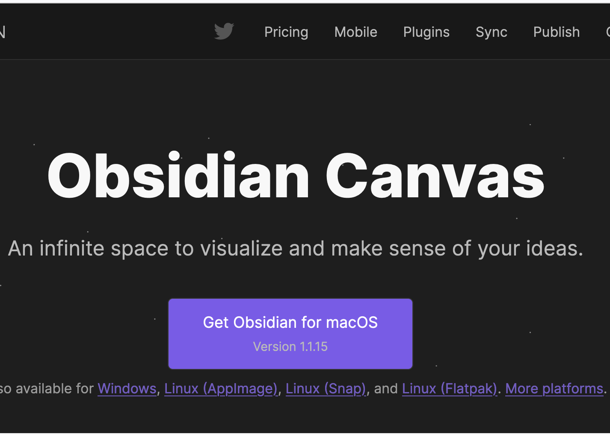

# Table of Contents

- [Table of Contents](#table-of-contents)
- [How this file is structured](#how-this-file-is-structured)
- [Bookmarks Level 1](#bookmarks-level-1)
- [Problem Solving Summary](#problem-solving-summary)
- [Raw threads of thinking](#raw-threads-of-thinking)
  - [Product Ideas](#product-ideas)
  - [Open Source Ideas](#open-source-ideas)
  - [What is the intended user experience from our website](#what-is-the-intended-user-experience-from-our-website)
  - [What is the intended user experience from our website](#what-is-the-intended-user-experience-from-our-website-1)
  - [How to write in this format](#how-to-write-in-this-format)
    - [List of solved questions](#list-of-solved-questions)
    - [List of unsolved questions](#list-of-unsolved-questions)
  - [How to strcuture Google Drive](#how-to-strcuture-google-drive)
  - [How Albus will think on meta level](#how-albus-will-think-on-meta-level)
    - [Hypothesis](#hypothesis)
      - [Meditation, Twitter \& Productivity](#meditation-twitter--productivity)
    - [Be a project of your girl cousins](#be-a-project-of-your-girl-cousins)
  - [Daily EoD Reflections](#daily-eod-reflections)
    - [26 Feb 2023](#26-feb-2023)
    - [25 Feb 2023](#25-feb-2023)
  - [Bookmarks Raw - Hyperlinks only](#bookmarks-raw---hyperlinks-only)
  - [Daily Raw Notes](#daily-raw-notes)
    - [28 Feb 2023 Tuesday](#28-feb-2023-tuesday)
  - [Unclassified experiments](#unclassified-experiments)
    - [Can I paste an image here and resize it](#can-i-paste-an-image-here-and-resize-it)

# How this file is structured

# Bookmarks Level 1

# Problem Solving Summary

# Raw threads of thinking

## Product Ideas

## Open Source Ideas

## What is the intended user experience from our website

## What is the intended user experience from our website

## How to write in this format

### List of solved questions

- How can we get an extension which can make copy pasting images
  Well we found one but its pretty new just giving it a spin here. We tried to paste a file in it but the biggest issue is that it is not able to resize the image. The name of the current one is Markdown Editor nu zaaack. We will try to find a better one.
  Other options are: Markdown All in One (it is not wysiwyg) & StackEdit (image resizing not solved)

### List of unsolved questions

- How to put bullets in markdown
- How to make sections collapsible
- How to create a Table of Contents for this Markdown File
- How can we get prettier to format this file
- 

## How to strcuture Google Drive

- How to structure the Archive

## How Albus will think on meta level

### Hypothesis

#### Meditation, Twitter & Productivity

May be when you meditate a lot, you don't feel like tweeting

### Be a project of your girl cousins

If you are Jain boy unable to find a girl for yourself

make really good friends with your cousins of opposite gender

once they start trusting you, they will inevitably try to make you their project

they will try to pair you up with their cousins or their friends

girls want to settle with someone they trust

a lot of trust is merely familiarity

you can get your familiarity points by being friends with their cousins

you don't even have to do anything to impress them anymore

your cousins will evangelize your candidature to your target segment

iykwim

## Daily EoD Reflections

### 26 Feb 2023

### 25 Feb 2023

I think I did good today
I explored a lot of things
Github copilot is definitely helpful
Anyways I am going to sleep now

Dear Mind,

We did good today

Thank you for your efforts & ingenuity

It is fun to pair with you

iykwim

In hindsight, I should probably keep all assets in Miro Boards which are public & link them to github via a URL in the markdown file

Just an idea

May be we should continue writing in text
Images are not that important

This
right here
what I have
is enough ...

## Bookmarks Raw - Hyperlinks only

## Daily Raw Notes

### 28 Feb 2023 Tuesday

Interesting day ahead.

I am going to try to do a few things today.

Less but better.

The interesting thing is that Copilot is now becoming a writing assistant.

Let us first clear out our head.

Things to do today :

- Important & Urgent
  - Check finances. All the accounts & assimilate them into a google sheet
    - Decide on the next steps for the SIPs
  - Affirmations
    - to start the day
    - every 3 hours
  - Cross-fit workout + Inclination walking
  - Physiotherapy sessions
- Important but Not Urgent
  - SOPs for daily activities
    - Eating & Drinking
    - Cleaning the body
- 

## Unclassified experiments

### Can I paste an image here and resize it

Apparently yes

Indians leaving India Youtube Video

